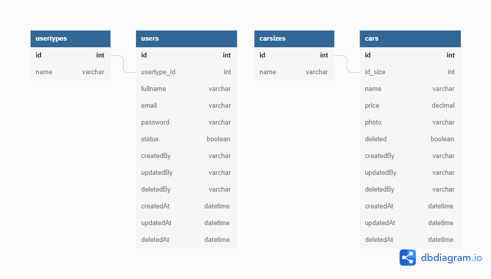

# Car Management API

Binar Challange Chapter 6

## Getting started

# Cloning Project

Buat repository folder pada local PC/Leptop, lalu klik kanan > Open With Visual Studio Code.
Buka Terminal bash git lalu copy & paste perintah:

```
git clone git@gitlab.com:Tsucie/binar-car-management.git
```

**Note**
Pastikan sudah membuat SSH key dan menambahkannya pada akun gitlab.
[Cara membuat SSH key](https://gitlab.com/help/user/ssh.md)

# Installation

Setelah membuka projek dengan Visual Studio Code, buka terminal (Powershell) dengan menekan tombol **CTRL + `**. Lalu copy & paste perintah:

```
npm i --save
```

# Run Project

Ketik perintah:

```
npm run dev
```

Untuk menjalankan projek menggunakan nodemon untuk development (Hot Reload).

Ketik perintah:

```
npm start
```

Untuk menjalankan projek.

# ERD


# DB Server
Server database menggunkaan elephantsql.com cloud

# Super Admin Account
Email:
```
admin@binarcrm.co.id
```
Password:
```
P@ssW0rd
```